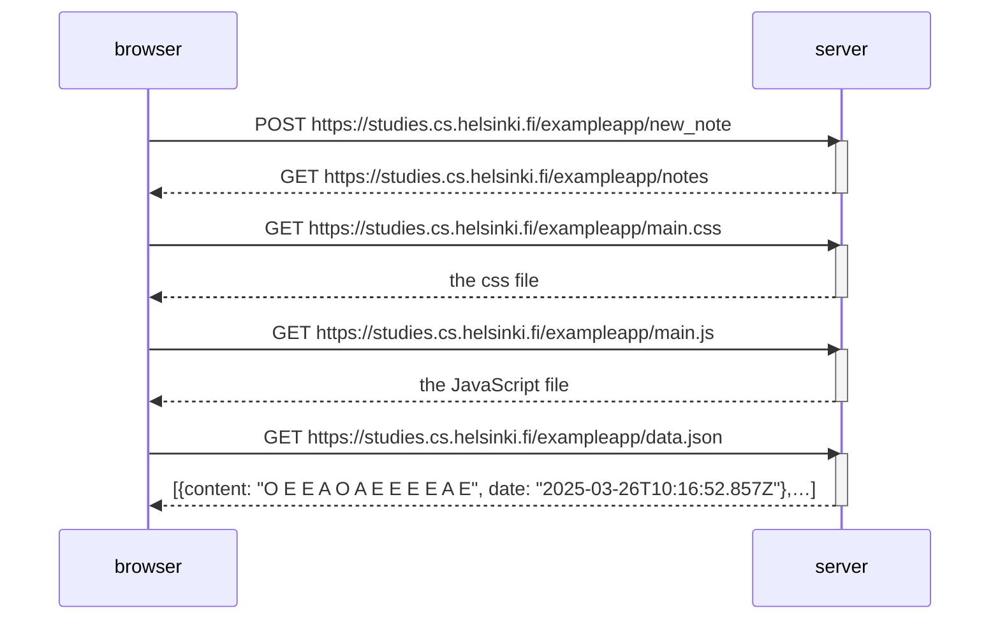

```mermaid
sequenceDiagram
    participant browser
    participant server

    browser->>server: POST https://studies.cs.helsinki.fi/exampleapp/new_note
    activate server
    server-->>browser: GET https://studies.cs.helsinki.fi/exampleapp/notes
    deactivate server

    browser->>server: GET https://studies.cs.helsinki.fi/exampleapp/main.css
    activate server
    server-->>browser: the css file
    deactivate server

    browser->>server:  GET https://studies.cs.helsinki.fi/exampleapp/main.js
    activate server
    server-->>browser:  the JavaScript file
    deactivate server

    browser->>server:  GET https://studies.cs.helsinki.fi/exampleapp/data.json
    activate server
    server-->>browser: [{content: "O E E A O A E E E E A E", date: "2025-03-26T10:16:52.857Z"},…]
    deactivate server
```